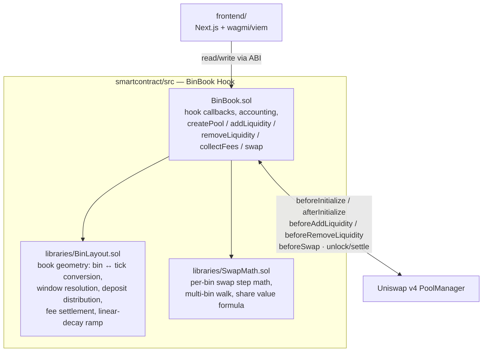

# BinBook

**A hook-owned, discretized liquidity book for Uniswap v4.**

BinBook replaces v4's native tick-range positions with a simpler model: liquidity is bucketed
into fixed-width **bins** around the active price, sized by a **linear-decay** ramp (more
liquidity near the current price, tapering out toward the edges — similar in spirit to Trader
Joe's Liquidity Book, built on v4's hook architecture). The hook itself owns every position;
users deposit tokens and the hook distributes them across bins on their behalf, tracking
per-user, per-bin balances plus a pool-wide, price-aware share accounting layer for fair
proportional ownership.

This repo has two halves:

- **[`smartcontract/`](smartcontract/)** — the Foundry project: the `BinBook` hook and its
  libraries, deployment scripts, and the full test suite. See
  [`smartcontract/README.md`](smartcontract/README.md) for build/test/deploy instructions.
- **[`frontend/`](frontend/)** — a Next.js app (wagmi/viem, no backend or indexer) for creating
  pools, providing liquidity, and swapping. See [`frontend/README.md`](frontend/README.md) for
  setup.

## Architecture



- **`BinBook.sol`** — the hook contract. Gateway for pool creation (`createPool`), custom
  accounting for `addLiquidity`/`removeLiquidity` (via OpenZeppelin's `BaseCustomAccounting`),
  the swap engine (`BaseCustomCurve`), and fee collection. Holds all per-pool state: the book,
  per-bin liquidity and fee growth, per-user positions, and pool-wide shares.
- **`BinLayout.sol`** — pure book geometry, no token movement. Converts a
  `[tickLower, tickUpper]` request into a bin range, resolves the linear-decay ramp, expands the
  book's tracked bounds, distributes a deposit's liquidity across bins, and settles per-bin fee
  growth into a position's owed tokens.
- **`SwapMath.sol`** — pure math, no storage. A single-bin CPMM swap step (mirroring v4-core's
  own `SwapMath`), a multi-bin walk across the book, the linear-decay liquidity-sizing formula,
  and the price-aware value formula shares are minted/burned against.
- **`frontend/`** — talks to `BinBook` directly over the ABI (no backend/indexer); reads pool and
  position state live from the chain.

## Core concepts

- **Bins, not ticks.** Each pool has a `binSize` (ticks per bin), fixed at creation. Liquidity
  lives per `(pool, bin)`, not per arbitrary tick range — a much smaller state space to walk on
  swaps and withdrawals.
- **Linear decay.** A deposit's liquidity peaks in the bin closest to the active price and
  decays linearly toward the edges of the requested range, so LPs don't need to manually shape
  a concentrated position.
- **Hook-owned positions.** v4 sees the hook as the sole liquidity provider; `BinBook` maintains
  its own per-user, per-bin ledger (`positions[poolId][user][binIndex]`) underneath that.
- **Price-aware shares.** LP shares are minted/burned against a token0-equivalent *value*
  (`SwapMath.valueOf`), computed from the pool's live price — not a raw `amount0 + amount1` sum,
  which would misprice a deposit based on which token it happened to land in.
- **Range-scoped `removeLiquidity`.** Withdrawals and fee collection are scoped to the caller's
  chosen `[tickLower, tickUpper]`, converted to a bin range and value-targeted against a pool-wide
  price snapshot — bounding a withdrawal's cost to the range requested, not everything the caller
  has ever touched in that pool.

## Getting started

```bash
# contracts
cd smartcontract && forge install && forge test

# frontend
cd frontend && npm install && npm run dev
```

See each subfolder's README for full setup, deployment, and configuration details.

## Additional Resources

- [Uniswap v4 docs](https://docs.uniswap.org/contracts/v4/overview)
- [v4-periphery](https://github.com/uniswap/v4-periphery)
- [v4-core](https://github.com/uniswap/v4-core)
- [v4-by-example](https://v4-by-example.org)
