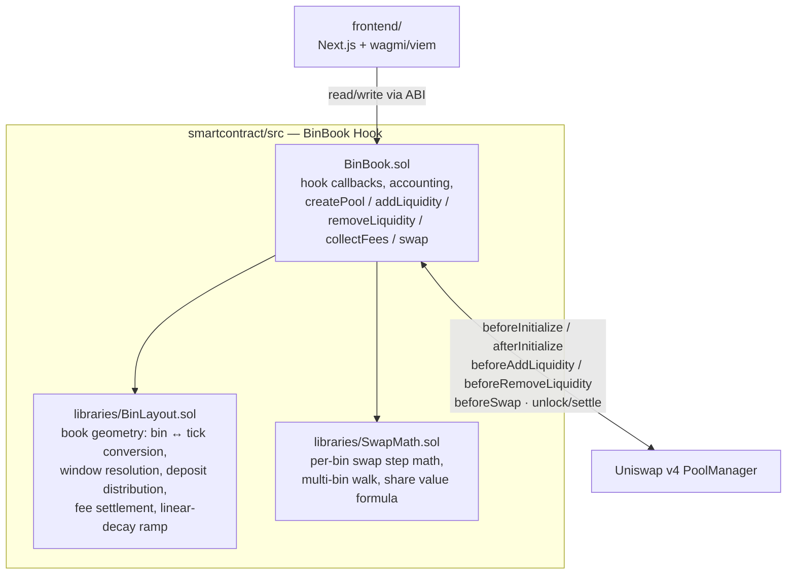

# BinBook

**A hook-owned, discretized liquidity book for Uniswap v4.**

📒 **[Interactive docs — architecture walkthrough + live sandwich-resistance data ↗](https://claude.ai/code/artifact/e42cca39-9f49-4eed-b74c-d30cceac78da)**

BinBook replaces v4's native tick-range positions with a simpler model: liquidity is bucketed
into fixed-width **bins** around the active price, sized by a **linear-decay** ramp (more
liquidity near the current price, tapering out toward the edges — similar in spirit to Trader
Joe's Liquidity Book, built on v4's hook architecture). The hook itself owns every position;
users deposit tokens and the hook distributes them across bins on their behalf, tracking
per-user, per-bin balances plus a pool-wide, price-aware share accounting layer for fair
proportional ownership.

This repo has two halves:

- **[`smartcontract/`](smartcontract/)** — the Foundry project: the `BinBook` hook and its
  libraries, deployment scripts, and the full test suite. See
  [`smartcontract/README.md`](smartcontract/README.md) for build/test/deploy instructions.
- **[`frontend/`](frontend/)** — a Next.js app (wagmi/viem, no backend or indexer) for creating
  pools, providing liquidity, and swapping. See [`frontend/README.md`](frontend/README.md) for
  setup.

## Architecture



- **`BinBook.sol`** — the hook contract. Gateway for pool creation (`createPool`), custom
  accounting for `addLiquidity`/`removeLiquidity` (via OpenZeppelin's `BaseCustomAccounting`),
  the swap engine (`BaseCustomCurve`), and fee collection. Holds all per-pool state: the book,
  per-bin liquidity and fee growth, per-user positions, and pool-wide shares.
- **`BinLayout.sol`** — pure book geometry, no token movement. Converts a
  `[tickLower, tickUpper]` request into a bin range, resolves the linear-decay ramp, expands the
  book's tracked bounds, distributes a deposit's liquidity across bins, and settles per-bin fee
  growth into a position's owed tokens.
- **`SwapMath.sol`** — pure math, no storage. A single-bin CPMM swap step (mirroring v4-core's
  own `SwapMath`), a multi-bin walk across the book, the linear-decay liquidity-sizing formula,
  and the price-aware value formula shares are minted/burned against.
- **`frontend/`** — talks to `BinBook` directly over the ABI (no backend/indexer); reads pool and
  position state live from the chain.

## Core concepts

- **Bins, not ticks.** Each pool has a `binSize` (ticks per bin), fixed at creation. Liquidity
  lives per `(pool, bin)`, not per arbitrary tick range — a much smaller state space to walk on
  swaps and withdrawals.
- **Linear decay.** A deposit's liquidity peaks in the bin closest to the active price and
  decays linearly toward the edges of the requested range, so LPs don't need to manually shape
  a concentrated position.
- **Hook-owned positions.** v4 sees the hook as the sole liquidity provider; `BinBook` maintains
  its own per-user, per-bin ledger (`positions[poolId][user][binIndex]`) underneath that.
- **Price-aware shares.** LP shares are minted/burned against a token0-equivalent *value*
  (`SwapMath.valueOf`), computed from the pool's live price — not a raw `amount0 + amount1` sum,
  which would misprice a deposit based on which token it happened to land in.
- **Range-scoped `removeLiquidity`.** Withdrawals and fee collection are scoped to the caller's
  chosen `[tickLower, tickUpper]`, converted to a bin range and value-targeted against a pool-wide
  price snapshot — bounding a withdrawal's cost to the range requested, not everything the caller
  has ever touched in that pool.

## Performance: why bins beat x·y=k for a meme launch

A meme-coin launch pool is thin, one-sided at first, and the first target for sandwich bots. To
check whether the bin+linear-decay design actually helps, `test/BinBook.sandwich.t.sol` runs the
same sandwich (attacker front-runs 2x the victim's size, victim trades, attacker back-runs) against
two pools seeded with **identical TVL and fee** — one a plain constant-product (x·y=k) curve, one
BinBook's bin book — and measures the attacker's ROI on both.

For a meme-shaped pool (30bps fee, ~3%-wide bins), sweeping the victim's trade size from 0.5% to
10% of pool TVL:

| Trade size (% of TVL) | x·y=k attacker ROI | BinBook attacker ROI | Sandwich profit cut |
|---|---|---|---|
| 0.5% | 1.34% | **loss** (-0.44%) | 100% |
| 1% | 3.19% | **loss** (-0.29%) | 100% |
| 2% | 6.61% | 0.02% | 99.7% |
| 3% | 9.72% | 0.32% | 96.7% |
| 5% | 15.08% | 0.97% | 93.5% |
| 10% | 24.81% | 2.78% | 88.8% |

*(`forge test --match-test test_sandwich_meme_sweep -vv` reproduces this; "profit cut" is
`1 - binROI/xykROI`, clamped to 100% when the bin attack is outright unprofitable.)*

Below ~2% of TVL — the range most retail buys and most bot front-runs actually fall in — sandwiching
BinBook is **unprofitable outright**, not just less profitable. The same pattern holds (bins beat
x·y=k) at stable-pair and mid-volatility fee/bin configurations too
(`test_sandwich_stable_binsBeatXyk`, `test_sandwich_mid_binsBeatXyk`).

**Why:** the linear-decay ramp concentrates depth in a shallow slice of bins right at the active
price rather than spreading it across the whole curve. An attacker's front-run of a given size
walks through much less depth before hitting the ramp's edge, so it moves price — and burns fee —
disproportionately more than the same-sized trade would on a flat x·y=k curve. That extra price
impact and fee drag on the *attacker's own* front-run is what eats their margin before the
back-run ever happens.

## Getting started

```bash
# contracts
cd smartcontract && forge install && forge test

# frontend
cd frontend && npm install && npm run dev
```

See each subfolder's README for full setup, deployment, and configuration details.

## Additional Resources

- [Uniswap v4 docs](https://docs.uniswap.org/contracts/v4/overview)
- [v4-periphery](https://github.com/uniswap/v4-periphery)
- [v4-core](https://github.com/uniswap/v4-core)
- [v4-by-example](https://v4-by-example.org)
