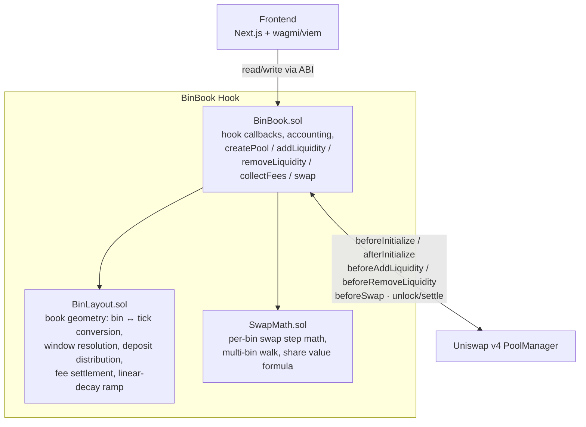

# BinBook

**A hook-owned, discretized liquidity book for Uniswap v4.**

BinBook replaces v4's native tick-range positions with a simpler model: liquidity is bucketed
into fixed-width **bins** around the active price, sized by a **linear-decay** ramp (more
liquidity near the current price, tapering out toward the edges — similar in spirit to Trader
Joe's Liquidity Book, built on v4's hook architecture). The hook itself owns every position;
users deposit tokens and the hook distributes them across bins on their behalf, tracking
per-user, per-bin balances plus a pool-wide, price-aware share accounting layer for fair
proportional ownership.

## Architecture



- **`BinBook.sol`** — the hook contract. Gateway for pool creation (`createPool`), custom
  accounting for `addLiquidity`/`removeLiquidity` (via OpenZeppelin's `BaseCustomAccounting`),
  the swap engine (`BaseCustomCurve`), and fee collection. Holds all per-pool state: the book,
  per-bin liquidity and fee growth, per-user positions, and pool-wide shares.
- **`src/libraries/BinLayout.sol`** — pure book geometry, no token movement. Converts a
  `[tickLower, tickUpper]` request into a bin range, resolves the linear-decay ramp, expands the
  book's tracked bounds, distributes a deposit's liquidity across bins, and settles per-bin fee
  growth into a position's owed tokens.
- **`src/libraries/SwapMath.sol`** — pure math, no storage. A single-bin CPMM swap step
  (mirroring v4-core's own `SwapMath`), a multi-bin walk across the book, the linear-decay
  liquidity-sizing formula, and the price-aware value formula shares are minted/burned against.

## Core concepts

- **Bins, not ticks.** Each pool has a `binSize` (ticks per bin), fixed at creation. Liquidity
  lives per `(pool, bin)`, not per arbitrary tick range — a much smaller state space to walk on
  swaps and withdrawals.
- **Linear decay.** A deposit's liquidity peaks in the bin closest to the active price and
  decays linearly toward the edges of the requested range, so LPs don't need to manually shape
  a concentrated position.
- **Hook-owned positions.** v4 sees the hook as the sole liquidity provider; `BinBook` maintains
  its own per-user, per-bin ledger (`positions[poolId][user][binIndex]`) underneath that.
- **Price-aware shares.** LP shares are minted/burned against a token0-equivalent *value*
  (`SwapMath.valueOf`), computed from the pool's live price — not a raw `amount0 + amount1` sum,
  which would misprice a deposit based on which token it happened to land in.
- **Range-scoped `removeLiquidity`.** Withdrawals and fee collection are scoped to the caller's
  chosen `[tickLower, tickUpper]`, converted to a bin range and value-targeted against a pool-wide
  price snapshot — bounding a withdrawal's cost to the range requested, not everything the caller
  has ever touched in that pool.

## Repo layout

```
src/
  BinBook.sol              # the hook
  libraries/
    BinLayout.sol           # book geometry
    SwapMath.sol             # swap & value math
test/                        # Foundry unit, fuzz, and stress tests (see below)
script/                      # deployment & pool-setup scripts
frontend/                    # Next.js app (wagmi/viem, no backend/indexer)
```

### Test suite

One file per concern, mirroring `src/`:

| File | Covers |
|---|---|
| `BinBook.createpool.t.sol` | The `createPool` gateway: bin size validation, currency ordering, hook binding |
| `BinBook.liquidity.t.sol` | `addLiquidity`/`removeLiquidity` mechanics, reverts, range-scoping |
| `BinBook.fees.t.sol` | Fee accrual and `collectFees` |
| `BinBook.swap.t.sol` | Swap execution against the book |
| `BinBook.shares.stress.t.sol` | Share-accounting fairness under many providers / full withdrawals |
| `BinBook.sandwich.t.sol`, `BinBook.regimes.t.sol` | Sandwich resistance and price-regime behavior vs. a plain x·y=k curve |
| `BinBook.mintManipulation.t.sol` | Regression: spot-price share minting can't be gamed via swap→deposit→swap-back |
| `libraries/BinLayout.t.sol`, `libraries/SwapMath.t.sol` | Pure library unit/fuzz tests |

```bash
forge test
```

## Get Started

### Requirements

Built with Foundry (stable). If you're on Foundry Nightly, update to stable:

```bash
foundryup
```

Install dependencies and run the tests:

```bash
forge install
forge test
```

### Local Development

Deployment and pool-setup scripts live in `script/`; they work against a local
[anvil](https://book.getfoundry.sh/anvil/) node or a live network.

#### Anvil

1. Start Anvil (optionally forking a live chain):

```bash
anvil
# or
anvil --fork-url <YOUR_RPC_URL>
```

2. Run a script:

```bash
forge script script/binbook/00_DeployBinBook.s.sol \
    --rpc-url http://localhost:8545 \
    --private-key <PRIVATE_KEY> \
    --broadcast
```

#### Live networks

Prefer a keystore over a raw private key on the command line:

```bash
cast wallet import <KEY_NAME> --interactive
```

```bash
forge script script/binbook/00_DeployBinBook.s.sol \
    --rpc-url <YOUR_RPC_URL> \
    --account <KEY_NAME> \
    --sender <YOUR_WALLET_ADDRESS> \
    --broadcast
```

### Frontend

```bash
cd frontend
npm install
npm run dev
```

Reads and writes go straight to the chain via wagmi/viem — no backend or indexer.

### Verifying the hook contract

```bash
forge verify-contract \
  --rpc-url <URL> \
  --chain <CHAIN_NAME_OR_ID> \
  --verifier <Verification_Provider> \
  --verifier-api-key <Verification_Provider_API_KEY> \
  --constructor-args <ABI_ENCODED_ARGS> \
  --num-of-optimizations <OPTIMIZER_RUNS> \
  <Contract_Address> \
  <path/to/BinBook.sol:BinBook> \
  --watch
```

### Troubleshooting

<details>
<summary>Permission Denied on <code>forge install</code></summary>

Typically caused by missing GitHub SSH keys — see
[connecting to GitHub with SSH](https://docs.github.com/en/github/authenticating-to-github/connecting-to-github-with-ssh),
or [add existing keys to your ssh-agent](https://docs.github.com/en/authentication/connecting-to-github-with-ssh/generating-a-new-ssh-key-and-adding-it-to-the-ssh-agent#adding-your-ssh-key-to-the-ssh-agent).

</details>

<details>
<summary>Anvil fork test failures</summary>

Some Foundry versions limit contract code size to ~25kb. Raise it:

```bash
anvil --code-size-limit 40000
```

</details>

<details>
<summary>Hook deployment failures</summary>

Almost always incorrect flags or salt mining:

1. Verify `getHookPermissions()` returns the flags actually being mined for.
2. Verify the salt-mining deployer matches the actual deployer:
   - In **forge test**: `address(this)` (or the `vm.prank`-ed address).
   - In **forge script**: the CREATE2 proxy, `0x4e59b44847b379578588920cA78FbF26c0B4956C`. If
     anvil doesn't have it deployed, update with `foundryup`.

</details>

### Additional Resources

- [Uniswap v4 docs](https://docs.uniswap.org/contracts/v4/overview)
- [v4-periphery](https://github.com/uniswap/v4-periphery)
- [v4-core](https://github.com/uniswap/v4-core)
- [v4-by-example](https://v4-by-example.org)
